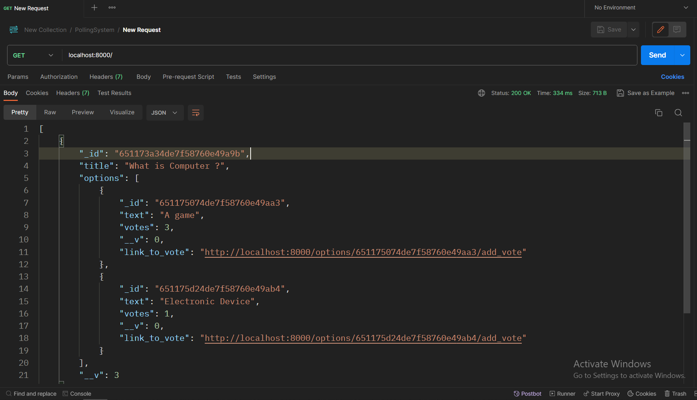
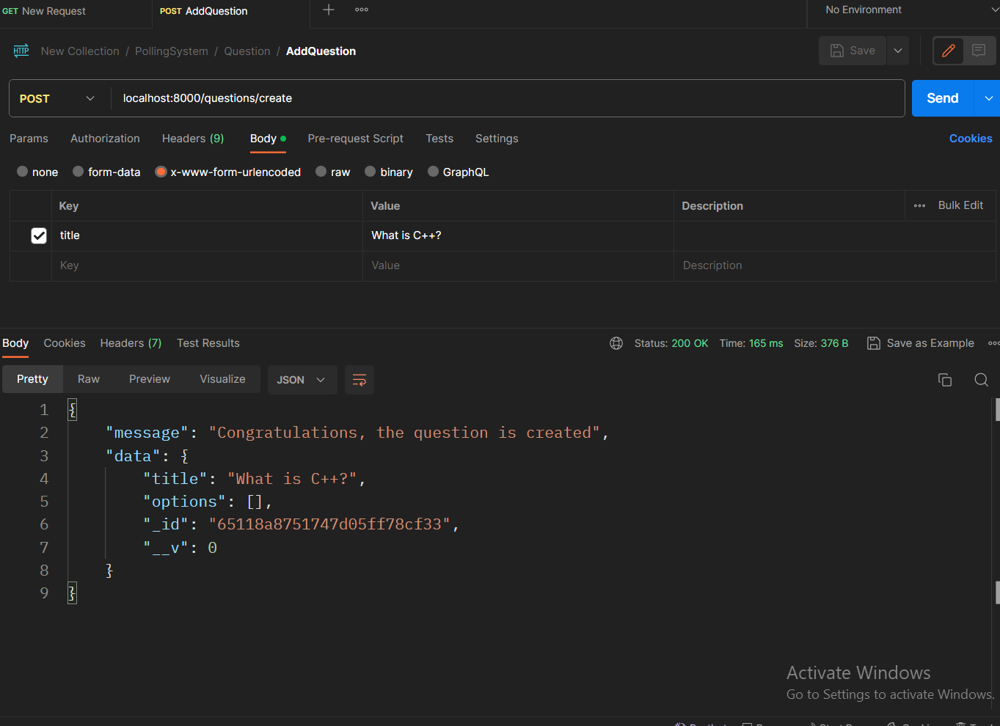
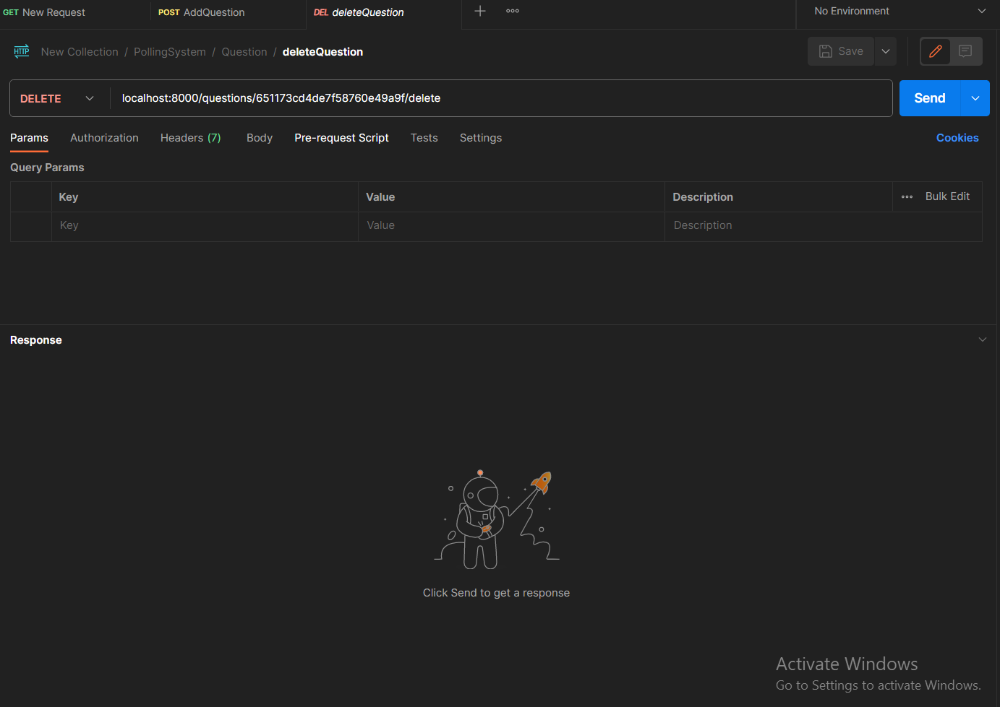
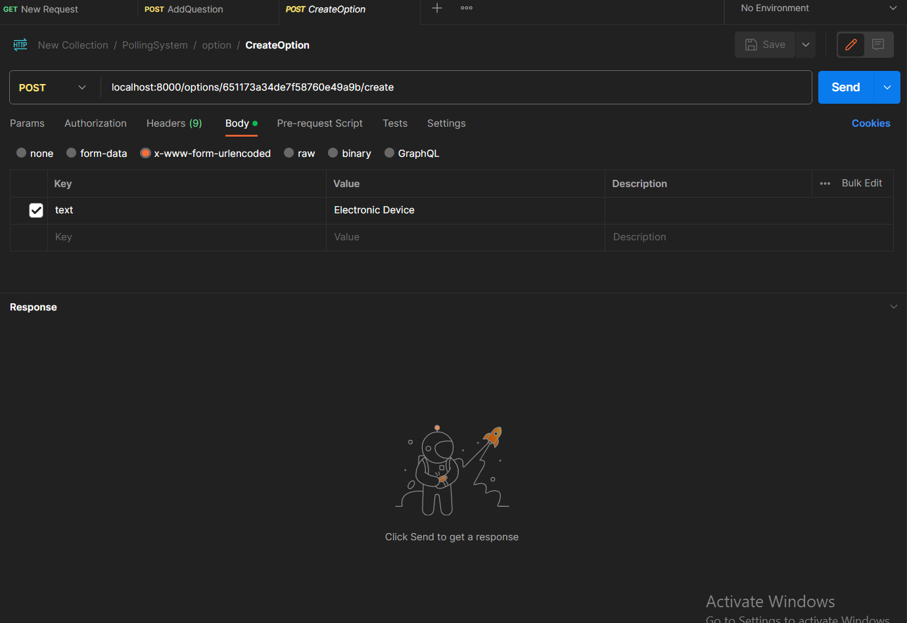
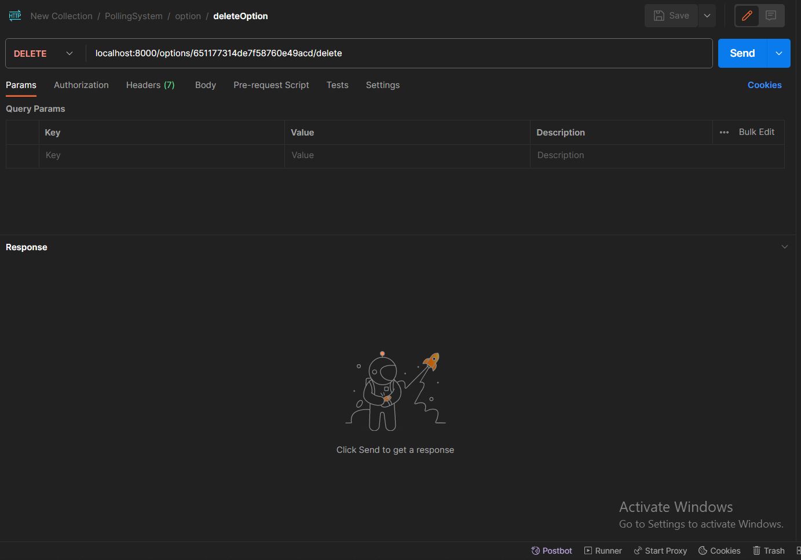

# Polling-System-API

Welcome to the Polling-System-API repository! This is the backend API for a polling system application, built using Node.js and MongoDB with the help of Express. Below, you'll find information on how to install and use this API, as well as an overview of its structure.

## Installation

To get started with the Polling-System-API, follow these steps:

1. Clone the repository to your local machine using the following command:
   ```sh
   git clone https://github.com/RaunakShrivastwa/pollingSystemAPI
   ```

2. Navigate to the project directory:
   ```sh
   cd pollingSystemAPI
   ```

3. Install the project dependencies by running:
   ```sh
   npm install
   ```

4. Start the API server:
   ```sh
   npm start
   ```

## Project Structure

The Polling-System-API is organized into different components, including routers, controllers, and models. Here's an overview of the project structure:

### Routers

1. **Index Router**: This is the default router for all APIs.

2. **Question Router**: Handles all API related to questions.

3. **Options Router**: Manages all API related to options.

### Controllers

1. **Index Controller**: Handles API functionality provided by the default router for various APIs.

2. **Questions Controller**: Manages API functionality related to questions.

3. **Options Controller**: Manages API functionality related to options.

### Models

The models represent the schema used in the project:

1. **Questions Schema**: Defines the schema for questions in the polling system.

2. **Options Schema**: Defines the schema for options associated with questions.

 

 

 

 

 

## Usage

You can interact with the Polling-System-API by making HTTP requests to the appropriate endpoints defined by the routers. Refer to the API documentation or the codebase for specific endpoint details and usage instructions.

Feel free to explore the codebase, contribute to the project, or integrate this API into your own applications. If you have any questions or encounter issues, please open an issue on this GitHub repository for assistance.

Thank you for using the Polling-System-API!